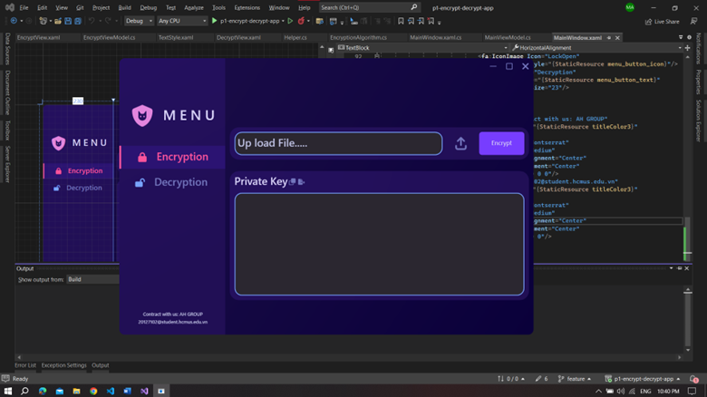
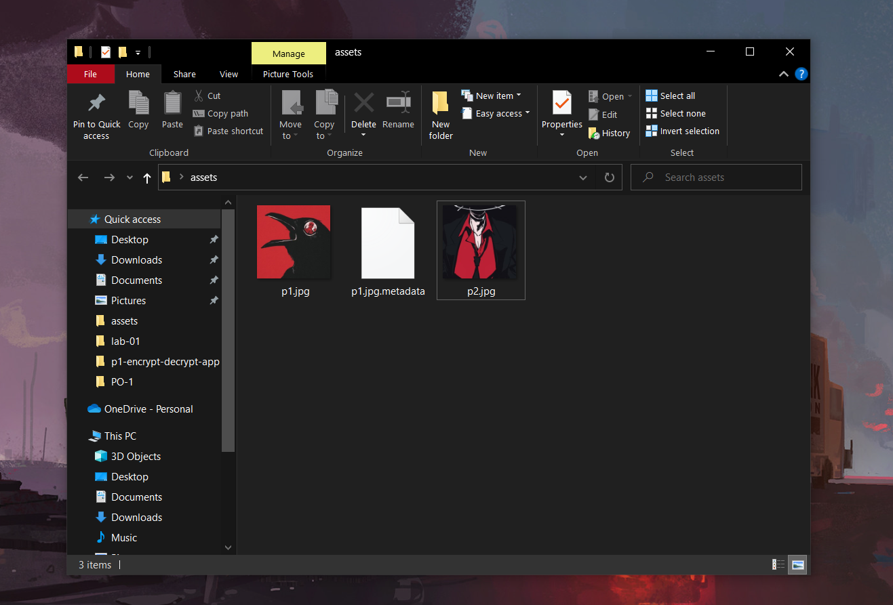
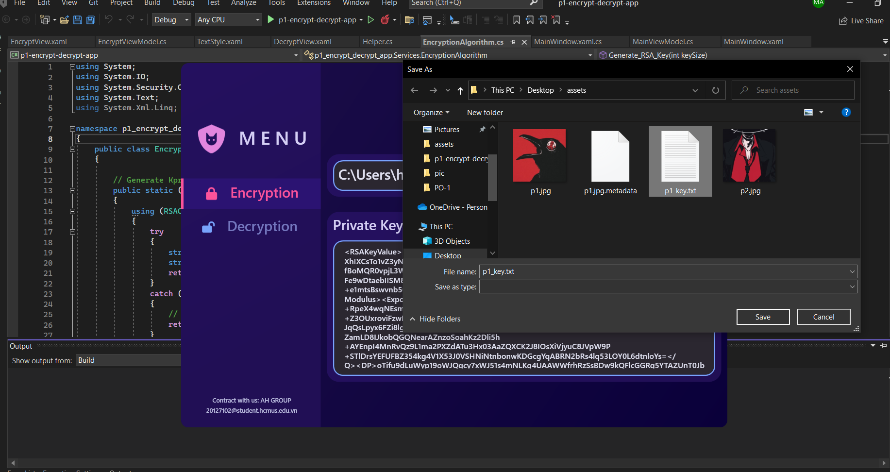
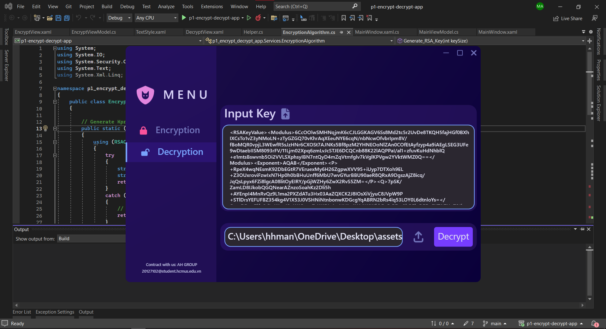
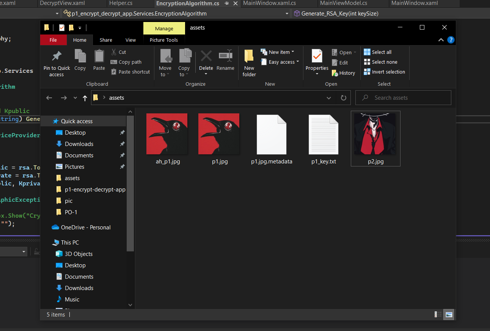

# 🔐 Encrypt-Decrypt-application

Write an application that uses C# to encrypt and decrypt a file.
- MVVM pattern 
- Use `AES` to encrypt file p into file C and generate private key Ks
- Use `RSA` to generate Kprivate and Kpublic and encrypt Ks by Kpublic.
- Hash Kprivate into Ks and store hash value 
- Output Kprivate and user can use it to decrypt file.
## 🤝 Members
Hoang Huu Minh An - 20127102

Tran Tien Hoang - 20127424

## 🏗️ Build Mode
- Using `System.Security.Cryptography`

- Class EncryptionAlgorithm
  - Generate `Kprivate` and `Kpublic` by `RSA` algorithm.
    - Length of keys: 64, 256, 1024, 2048 bits
  - Calculate hash value of string by `SHA-1`, `SHA-256`
  - Generate `Ks` by `AES` algorithm.
## 🖥️ GUI

- Encrypt

- Decrypt

## 🔎 How to use

- Allows users to encrypt a file in steps
  - The user selects the file to encrypt.
  - The system generates secret key `Ks` and encrypts file P into file C using `AES` algorithm.
  - The system generates the `Private` and `Public` key pairs of the `RSA` algorithm and encrypts the key `Ks` with the Kpublic key, the output is the string `Kx`.
  - The system saves the `Kx` string with the SHA-1 hash value of Kprivate (called `HKprivate`). Can be exported to a `C.metadata` file, where C is the name of the above C file, the file structure is optional (XML, JSON, Plain text...).
  
  - Export Private Key.
  

- Allows users to decrypt a file in steps
  - The user selects the file to decrypt.
  - The user kprivate
  
  - The system checks if Kprivate's SHA-1 hash value is the same as HKprivate's
  - Decrypt the string Kx to get Ks using Kprivate
  - Use Ks to decode file C into file P.
  

## Link Demo
